# DevOps Case Study - Netflix (Q1)

## Overview
This project demonstrates DevOps principles that address the weaknesses of a monolithic architecture, modeled after Netflix's move to microservices and Chaos Engineering after the 2008 database corruption incident.

The project containerizes a Node.js (Express) microservice, orchestrates it with Kubernetes, automates configuration with Ansible, implements a CI/CD pipeline with GitHub Actions, and adds observability with Prometheus and Grafana.

Note: this is a small simulation of the ideas, not Netflix's real system.

## Architecture
Developer -> GitHub Actions -> Docker Build -> GitHub Container Registry -> Kubernetes Cluster -> Prometheus -> Grafana

## Tech Stack
* Application: Node.js (Express, prom-client)
* Containerization: Docker
* Orchestration: Kubernetes (Docker Desktop on macOS)
* CI/CD: GitHub Actions
* Configuration Management: Ansible
* Monitoring & Logging: Prometheus & Grafana

## Repository Structure
* `.github/workflows/deploy.yml` - Task 1: CI/CD Pipeline
* `docs/pipeline-diagram.md` - Task 1: Pipeline Diagram
* `ansible/inventory.ini` - Task 2: Ansible Inventory
* `ansible/playbook.yml` - Task 2: Configuration Management
* `ansible/templates/app.env.j2` - Task 2: Config template
* `k8s/deployment.yaml` - Task 3: Kubernetes Deployment
* `k8s/service.yaml` - Task 3: Kubernetes Service
* `k8s/servicemonitor.yaml` - Task 4: Prometheus ServiceMonitor
* `grafana/netflix-dashboard.json` - Task 4: Grafana Dashboard
* `docs/slides.md` - Task 5: Slide content
* `src/app.js`, `src/server.js` - Node application
* `test/app.test.js` - Automated tests
* `scripts/load.sh` - Traffic generator for dashboards
* `Dockerfile` - Task 3: Dockerization
* `screenshots/` - Evidence for every task

## Pipeline Flow
1. Developer pushes code to the `main` branch.
2. GitHub Actions triggers the pipeline.
3. Job 1 (Test): Installs Node.js, dependencies, and runs tests.
4. Job 2 (Build & Push): Builds the Docker image and pushes to GitHub Container Registry.
5. Kubernetes runs the image and performs a zero-downtime rolling update.
6. Prometheus scrapes metrics and Grafana visualizes uptime, latency, and error rates.

## Task Evidence
### Task 1 - Deployment Strategy
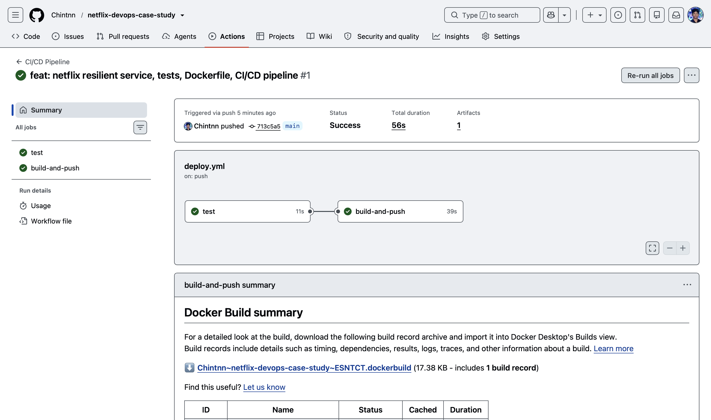
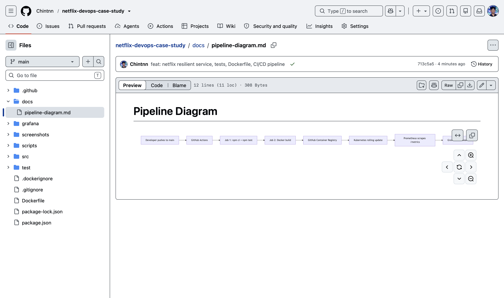
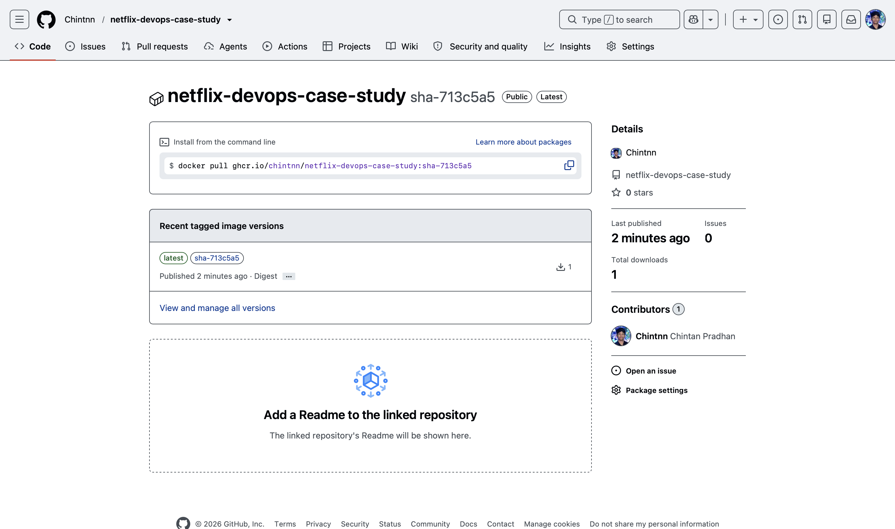

### Task 2 - Configuration Management
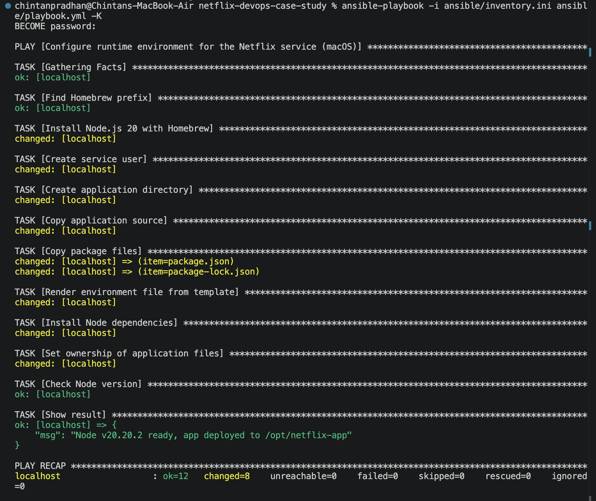
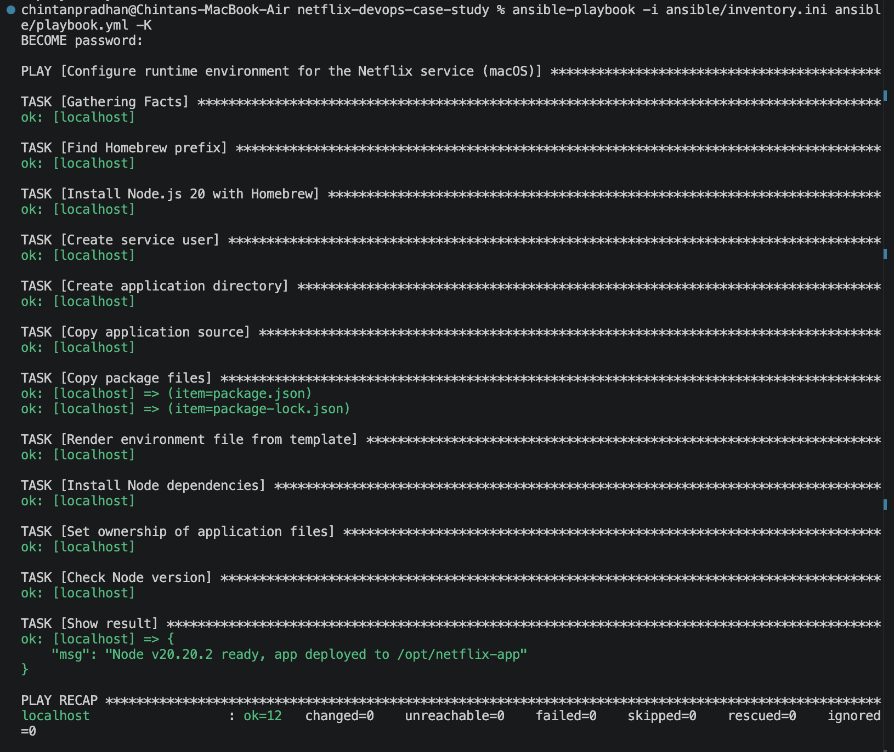
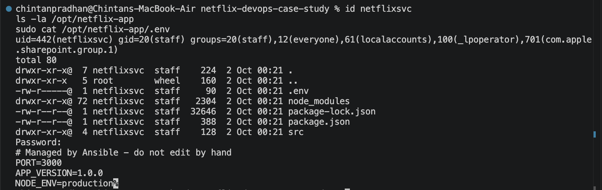

### Task 3 - Containerization & Orchestration
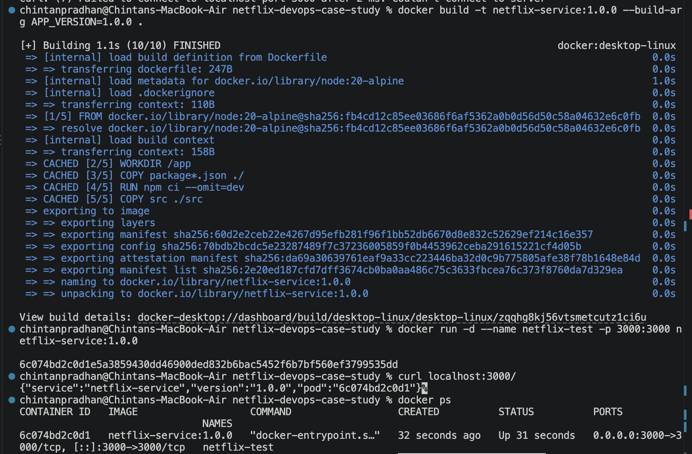
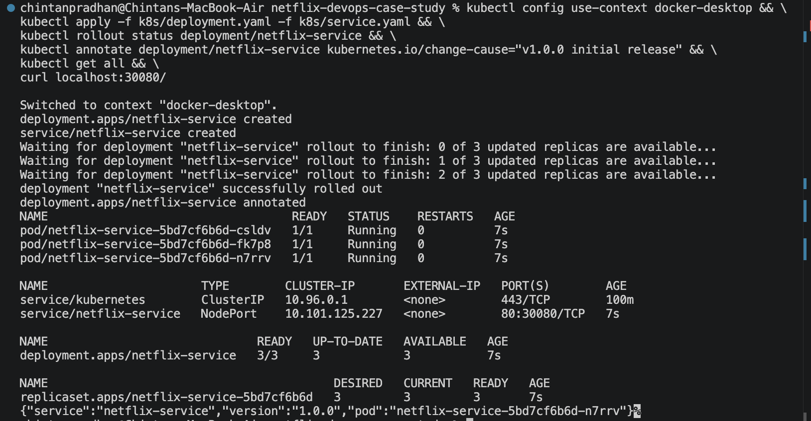
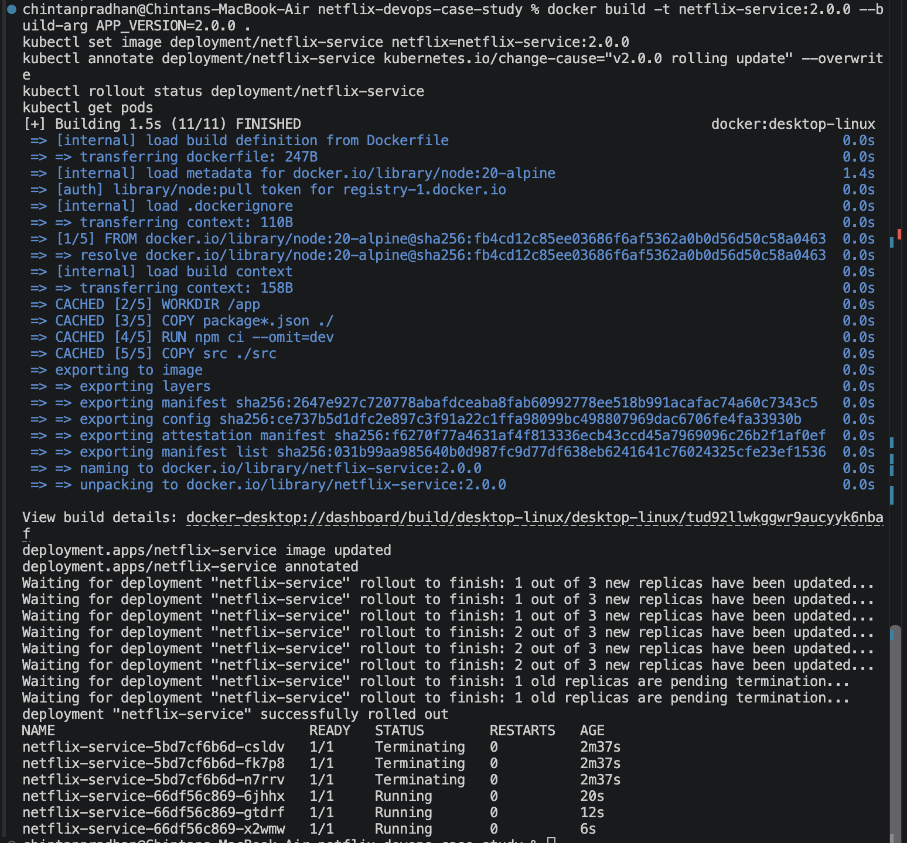
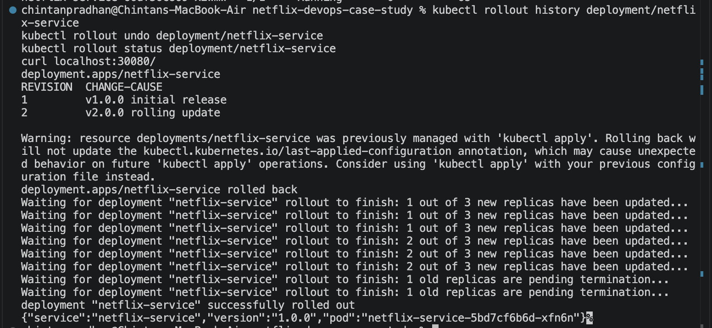
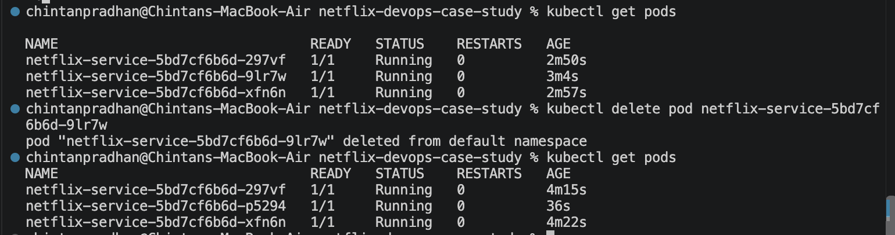

### Task 4 - Monitoring & Logging
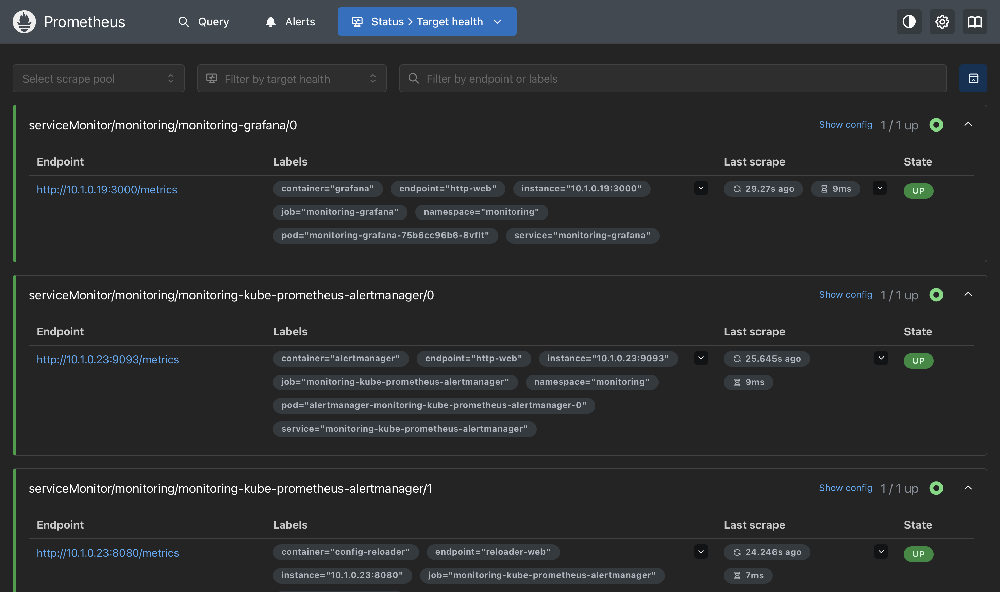
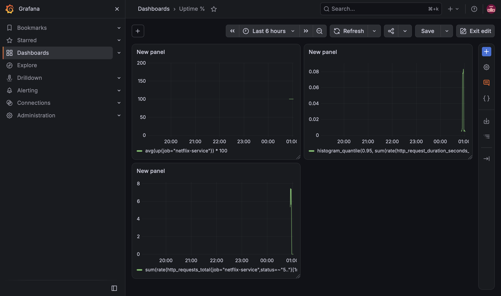

## Challenges Faced
* Linux-oriented tooling on macOS: the Ansible playbook was written for macOS, using Homebrew and a macOS service user instead of apt.
* Homebrew cannot run as root: those Ansible tasks run with `become: false`, while file and user tasks use sudo.
* Resource Constraints: Docker Desktop needed more memory (Settings > Resources) for the monitoring stack.
* ServiceMonitor Discovery: Prometheus ignored the ServiceMonitor until it had the label `release: monitoring`.
* Local Images in Kubernetes: Needed `imagePullPolicy: IfNotPresent` so Kubernetes used locally built images.

## Lessons Learned
* Design for failure: the recommendation fallback keeps the app useful when a dependency breaks.
* Chaos Engineering: deleting a pod on purpose showed Kubernetes self-healing in seconds.
* Automation: Ansible, GitHub Actions, and Kubernetes remove manual errors.
* Observability: Prometheus and Grafana make uptime, latency, and error rate visible.
* Resilience: rolling updates and rollbacks allow safe, zero-downtime releases.

## Connection to Netflix Case Study
In 2008 a database corruption stopped Netflix from shipping DVDs for three days, exposing the risk of a tightly coupled monolith. Netflix moved to cloud-based microservices and pioneered Chaos Engineering so that failures are expected and rehearsed.

This project shows that idea in practice. A failed dependency degrades gracefully instead of causing an outage, a deleted pod is replaced automatically, releases roll out and roll back without downtime, and the dashboard shows the health of the service at all times.